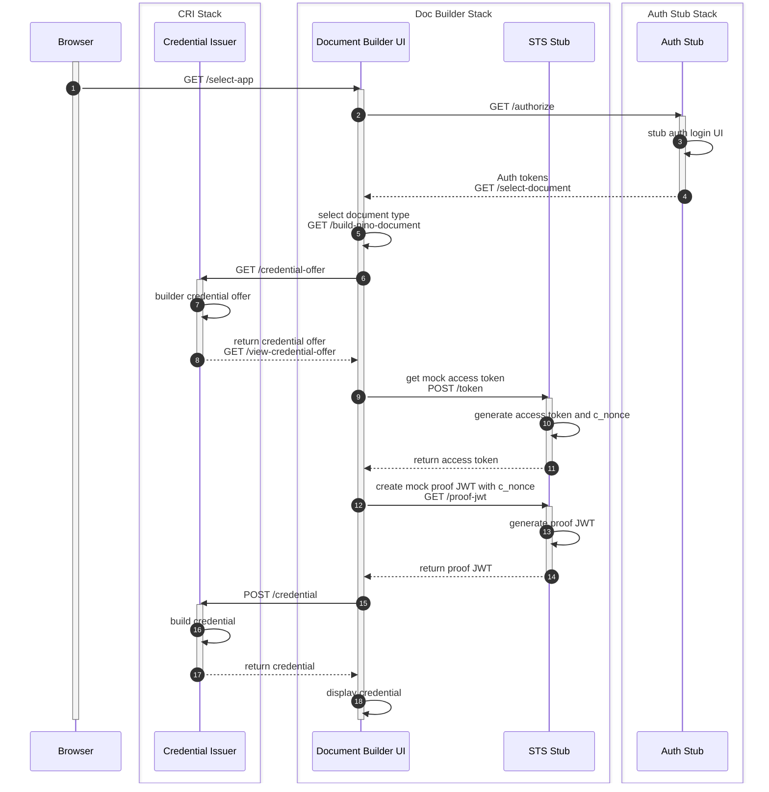

# Overview of Wallet Credential Issuance with Doc Builder

In order to be able to generate and issue mock credentials in DEV instances of the Doc Builder, Auth Stub and Example CRI stack need to be deployed which refer to each other.

The Doc Builder can then be used to generate a credential which is displayed as en encoded JWT and with decoded claims in the doc-builder UI, and the credential offer is exposed as a link and a QR code so the credential can be retrieved by the app and rendered.

The diagram below shows the call sequence involved:

