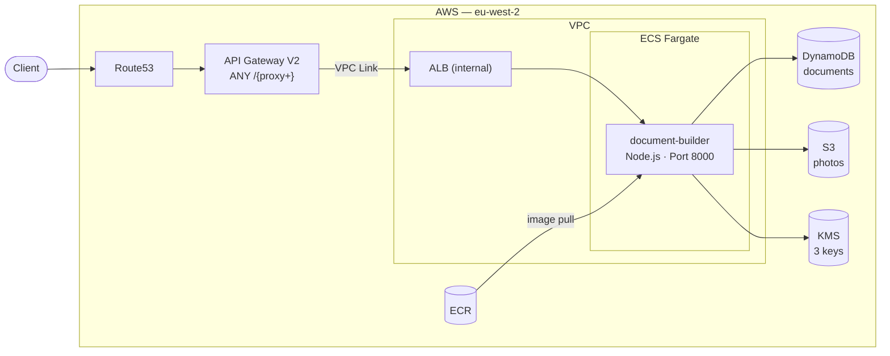

# Infrastructure Overview

Mobile Wallet Document Builder runs as an ECS Fargate container in AWS eu-west-2.

```mermaid
flowchart LR
    client(["Client"])

    subgraph aws ["AWS — eu-west-2"]

        dns["Route53"]
        agw["API Gateway V2\nANY /{proxy+}"]

        subgraph vpc ["VPC"]
            alb["ALB (internal)"]
            subgraph ecs ["ECS Fargate"]
                container["document-builder\nNode.js · Port 8000"]
            end
        end

        ecr[("ECR")]
        ddb[("DynamoDB\ndocuments")]
        s3[("S3\nphotos")]
        kms[("KMS\n3 keys")]

    end

    client --> dns --> agw
    agw -->|"VPC Link"| alb --> container
    ecr -->|"image pull"| container
    container --> ddb
    container --> s3
    container --> kms
```